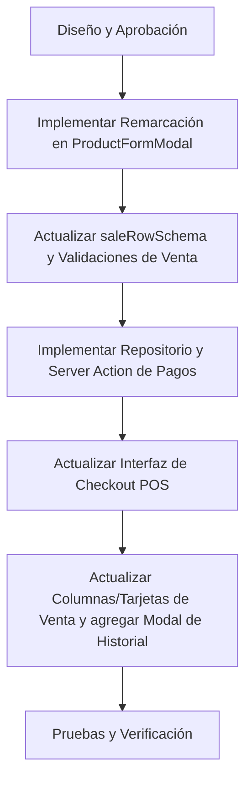

# Plan de Diseño e Implementación: Remarcación y Pagos Parciales

Este plan detalla el diseño técnico y la secuencia de pasos para implementar los dos nuevos requerimientos en la aplicación **ArgenStock**:

1. **Calculadora de Porcentaje de Remarcación (Markup)** en el formulario de ingreso de stock de producto.
2. **Pagos Parciales y Control de Historial de Pagos** en el módulo de ventas.

---

## 1. Porcentaje de Remarcación (Markup Helper)

### Objetivo
Agregar un campo de porcentaje de remarcación (`% Remarcación`) en el formulario de creación/edición de productos. Este campo servirá como ayuda visual para calcular automáticamente el `Precio de Venta` en base al `Precio de Costo` y viceversa, sin guardarse de forma directa en la base de datos.

### Diseño Técnico e Interacción
- **Ubicación**: `src/features/product/ui/components/product-form-modal.tsx`.
- **Estructura visual**: Modificar la fila de precios para tener 3 columnas en pantallas grandes:
  1. Precio de Costo (`purchasePrice`)
  2. % Remarcación (`markupPercentage`) - Campo nuevo de tipo texto/número.
  3. Precio de Venta (`salePrice`)
- **Reglas de Cálculo**:
  - Si se modifica **Precio de Costo** y el **% Remarcación** tiene un valor:
    $$\text{Precio de Venta} = \text{Precio de Costo} \times \left(1 + \frac{\% \text{Remarcación}}{100}\right)$$
  - Si se modifica el **% Remarcación** y el **Precio de Costo** tiene un valor:
    $$\text{Precio de Venta} = \text{Precio de Costo} \times \left(1 + \frac{\% \text{Remarcación}}{100}\right)$$
  - Si se modifica directamente el **Precio de Venta** y el **Precio de Costo** es mayor a 0:
    $$\% \text{Remarcación} = \left(\frac{\text{Precio de Venta} - \text{Precio de Costo}}{\text{Precio de Costo}}\right) \times 100$$
- **Tratamiento de Comas y Decimales**:
  - Dado que la app usa comas `,` como separador decimal para evitar conflictos regionales, utilizaremos funciones auxiliares de parseo y formateo:
    - `parseFormattedNumber(val: string): number`
    - `formatNumberForForm(num: number): string` (usa `toFixed(2).replace('.', ',')`)
- **Inicialización (Edición)**:
  - Cuando se carga un producto para editar, calcularemos el porcentaje de remarcación inicial a partir de los precios actuales y rellenaremos el campo de `% Remarcación`.

---

## 2. Pagos Parciales e Historial de Pagos

### Objetivo
Permitir que las ventas se realicen con pagos parciales (o sin pago inicial), registrar el saldo pendiente, y permitir agregar pagos adicionales a una venta existente en cualquier momento hasta completarla. Además, se debe poder consultar la fecha y monto de cada pago parcial.

### Diseño de Datos (Database & Schema)
El esquema actual ya cuenta con una tabla de pagos relacionados (`sale_payments`) vinculada a la venta (`sales`), lo cual facilita enormemente la arquitectura:
- La fecha de cada pago ya se almacena automáticamente en `sale_payments.createdAt`.
- **Modificación en el schema de validación (`src/features/sale/domain/sale.schema.ts`)**:
  - Actualmente, `saleCreateSchema` requiere de forma obligatoria al menos un pago (`.min(1)`). Cambiaremos esto para permitir que `payments` sea opcional o esté vacío (para ventas al crédito/pago 0), y eliminaremos la restricción que obliga a que la suma de pagos sea igual al total en el backend si el saldo queda pendiente.
  - Añadiremos el campo `createdAt` en la definición de pagos del schema de lectura (`saleRowSchema`) para poder consumirlo y mostrarlo en la interfaz.

### Nuevas Funcionalidades del Servidor (Server Actions & Repositorios)
- **Repositorio (`src/features/sale/repository/sale.repository.ts`)**:
  - Implementar `addPayment(saleId: string, type: 'efectivo' | 'transferencia', amount: number, tx)`:
    - Bloquea la venta con `FOR UPDATE` para evitar condiciones de carrera (doble pago simultáneo).
    - Calcula el total pagado sumando los montos de `sale_payments` asociados a la venta.
    - Valida que el nuevo monto de pago no exceda el saldo pendiente.
    - Inserta el nuevo registro en `sale_payments`.
- **Server Action (`src/features/sale/actions/sale.actions.ts`)**:
  - Implementar `addSalePaymentAction(saleId: string, type: 'efectivo' | 'transferencia', amount: number)`:
    - Valida autenticación y rol.
    - Ejecuta en una transacción de base de datos la inserción y comprobación del pago.
    - Registra un log de auditoría (`recordAuditLog`) con acción `CREAR` sobre la entidad `SALE_PAYMENT`.

### Modificaciones en el Checkout de Ventas (Front-End)
- **Modal de Pago (`src/features/sale/ui/components/sale-payment-modal.tsx`)**:
  - Permitir que el total cobrado sea menor al total de la venta (`currentCovered <= total`).
  - Si el total cobrado es 0 (o menor al total), permitir confirmar la venta, registrándola como "pago parcial" o "pendiente".

### Visualización e Historial en la Lista de Ventas
- **Estado de Pago en Columnas y Tarjetas**:
  - En la tabla de ventas (`sales-columns.tsx`) y tarjetas (`sales-card.tsx`), mostraremos un indicador visual:
    - **Pagado** (Verde) si el saldo restante es 0.
    - **Parcial (Falta $X)** (Amarillo) si se pagó algo pero hay saldo pendiente.
    - **Pendiente (Falta $X)** (Rojo) si no se registra ningún pago inicial.
- **Detalle e Historial de Pagos**:
  - Añadir una acción en la lista de ventas (un icono de pesos/tarjeta `$`) llamado **"Ver Pagos"** o **"Gestionar Pagos"**.
  - Este botón abrirá un nuevo modal: `SalePaymentsHistoryModal.tsx`.
  - **Componente `SalePaymentsHistoryModal.tsx`**:
    - Muestra los datos de la venta: Cliente, Fecha, Total.
    - Lista el historial de pagos: Fecha y Hora del pago, Tipo (Efectivo/Transferencia) y Monto.
    - Muestra el balance: Total Cobrado vs. Saldo Pendiente.
    - Si queda saldo pendiente, muestra un formulario rápido para agregar un nuevo pago (método + monto), el cual llamará al Server Action y refrescará la vista.

---

## Plan de Ejecución Secuencial

### 1. Fase 1: Remarcación de Precios
- Modificar `ProductFormModal.tsx` para incluir el campo `% Remarcación` y la lógica reactiva bidireccional entre costo, remarcación y venta.

### 2. Fase 2: Backend de Pagos Adicionales
- Actualizar `sale.schema.ts` para permitir `payments` opcionales en la creación, y añadir `createdAt` a la lectura de pagos.
- Agregar `addPayment` al `sale.repository.ts`.
- Agregar `addSalePaymentAction` a `sale.actions.ts`.

### 3. Fase 3: Frontend de Pagos Parciales
- Modificar `sale-payment-modal.tsx` para quitar la regla restrictiva de que la suma de pagos sea idéntica al total.
- Crear el componente `SalePaymentsHistoryModal.tsx`.
- Modificar `sales-columns.tsx` y `sales-card.tsx` para reflejar el estado de pago, saldo pendiente y agregar la acción de gestionar pagos.
- Integrar el modal y la acción en `sales-panel.tsx`.
